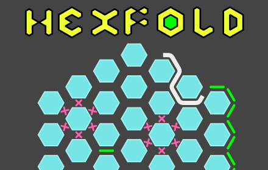
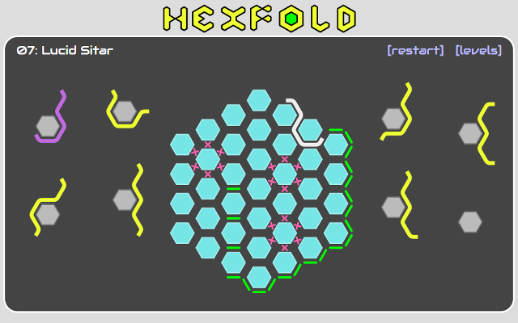

# HexFold

#### A web-based puzzle game

[Play it online](https://sbj42.github.io/projects/hexfold/), or [install it as a Chrome App](https://chrome.google.com/webstore/detail/hexfold/abmdjkdophekkfdeinpiklbabklhemch)!

The object of the game is to place the pieces on the board to create a loop, using every piece and obeying certain constraints that are different for each level.

Inspired by the puzzle toy [Cool Circuits](https://sciencewiz.com/product/cool-circuits).

## Run it locally

~~~
npm install
npm start
~~~
